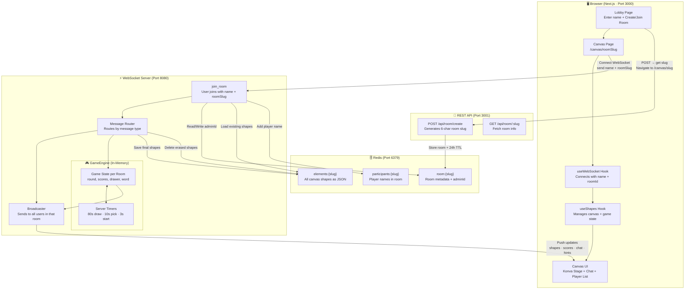

# NebulaSketch 🎨

A real-time, multiplayer collaborative drawing and word-guessing game (similar to Skribbl.io). Players can join shared rooms instantly without registering, take turns drawing a secret word, and guess what's being drawn in a live chat.

---

## 🏗️ System Architecture

Below is the system architecture showing how the Next.js frontend, Express REST API, WebSocket server, and Redis data layer communicate:


### Architecture Overview (Flowchart)



---

## ✨ Features

- **Real-Time Collaboration:** Throttled 30fps WebSocket messaging ensures other players see live strokes as they are drawn.
- **Turn-Based Game Loop:** Fully managed in-memory on the server, coordinating lobbies, word selection, round clocks, dynamic hint reveals, and scoring.
- **No-Authentication Rooms:** Guest identities are maintained via browser `localStorage` combined with ephemeral Redis sessions.
- **Auto-Expiration & Cleanup:** Rooms and canvas histories automatically delete from Redis after 24 hours of inactivity, or 60 seconds after the last participant disconnects.
- **Robust Canvas Interface:** Implemented using Konva.js with pen, selection, shape resizing, and layer composite operations for erasers.

---

## 🚀 Quick Start (Local Development)

### 1. Prerequisites
- [Node.js](https://nodejs.org/) (v18+)
- [pnpm](https://pnpm.io/) (`npm i -g pnpm`)
- [Docker & Docker Compose](https://www.docker.com/)

### 2. Start Redis
Launch the in-memory cache layer:
```bash
docker-compose up -d
```

### 3. Install Dependencies
Install packages across the monorepo workspace:
```bash
pnpm install
```

### 4. Set Up Environment Variables
Create `.env` files in the respective directories based on the templates:

*   **REST Backend (`apps/backend/.env`):**
    ```env
    JWT_SECRET=your-secret-key-min-32-chars
    PORT=3001
    NODE_ENV=development
    REDIS_URL=redis://localhost:6379
    ```
*   **Next.js Frontend (`apps/web/.env`):**
    ```env
    NEXT_PUBLIC_API_URL=http://localhost:3001
    NEXT_PUBLIC_WS_URL=ws://localhost:8080
    ```

### 5. Run the Project
Start the frontend, REST backend, and WebSocket server simultaneously:
```bash
pnpm dev
```

The services will be accessible at:
- **Frontend (UI):** http://localhost:3000
- **REST API:** http://localhost:3001
- **WebSocket:** ws://localhost:8080

---

## 📂 Project Structure

```
draw-app/
├── apps/
│   ├── web/           # Next.js 16 + React 19 Frontend (Port 3000)
│   ├── backend/       # Express REST API (Port 3001)
│   └── ws-backend/    # Node.js WebSocket & Game Engine (Port 8080)
├── packages/
│   ├── common/        # Shared Zod validation schemas & TypeScript types
│   ├── backend-common/# Shared Redis clients and environment configuration
│   └── db/            # Prisma schemas (Reserved for future persistence)
```
